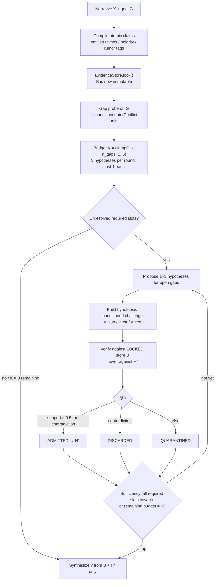

# EVAR, implemented as an admission gate rather than another reasoning loop

I built this because I keep watching long-context models write a confident intermediate — “she sold ledgers before, so she probably took this one too” — and then treat that sentence as if it had been in the story. Once the hypothesis is in the chain, later steps cite it. The chain looks coherent. The evidence never showed up.

I noticed that most “let’s think harder” stacks (CoT, self-refine, GoT-style expansion) make this worse: they generate more intermediates, not fewer, and they have no locked object that is allowed to say *no*. Liu, Ji, and Ping’s EVAR paper (arXiv:2608.29835, accepted EMNLP 2026) names the missing piece: **hypothesis admission**. Compile the narrative into an immutable evidence store, spend an instance-specific budget proposing candidates for unresolved gaps, and verify each candidate against the *locked original store* before it can enter the answer-supporting state. Supported → ADMITTED. Unverifiable → QUARANTINED. Contradictory → DISCARDED. Stop when the admitted set covers the required slots, or the budget hits zero.

This repo is my weekend reference implementation of that admission loop. It is **not** the authors’ official code. The default reasoner is a deterministic, fully offline heuristic — not the paper’s LLM operators (`M_πATOM`, `M_πHYP`, `M_πVER`, …). I did not copy NarraCrime numbers; I did not invent any.

Paper: Liu, Ji, Ping. *EVAR: Evidence-Validated Hypothesis Admission for Budget-Aware Narrative Reasoning*. arXiv:2608.29835, 30 Aug 2026. EMNLP 2026.

## When I’d actually use this

I would put this *in front of* an LLM, not instead of one, anywhere the source is long, non-interactive, and someone will act on the answer. The gate is useful when mixing fact, rumor, and model-invented glue is the failure mode:

- **Incident reviews.** A postmortem blob mixes Datadog facts, Slack guesses, and “probably the deploy.” I want “the deploy caused the 5xx” admitted only if the locked timeline supports it. A rumor in `#incidents` stays quarantined. Two timestamps that cannot both be true discard the story that needs both.
- **Contract / policy Q&A.** Asking “can we terminate for convenience in year one?” against a 40-page MSA. A model that infers a clause that is not there is worse than `QUARANTINED`. Contradiction against an explicit exclusive-remedy paragraph should `DISCARD`, not average.
- **RAG over diligence memos.** Retrieval can surface a paragraph. It cannot stop the model from welding paragraph 4 and paragraph 19 into a third fact that neither contains. Lock the retrieved text, then admit hypotheses against that store only.
- **Agent traces.** Tool output is evidence. The agent’s own earlier thought is not. Same gate: a coding agent that decided “this flag defaults to true” in turn 3 should not get to cite that in turn 9 unless a file read still says so.
- **Fraud / KYC / claims files.** Narratives with two addresses, two employers, or a hearsay “customer said they paid.” Exclusive fillers discard. Unverifiable hearsay quarantines. Only source-linked claims get to support the decision.

I would **not** reach for this when inventing the missing step is the point: brainstorming, code generation, or a first draft. The whole design is a *no* object. If you need a yes-object, skip the gate.

The Harbor Watch demo is a toy of that pattern: rumor stays rumor, an alibi kills a fluent suspect story, and the answer is allowed to use only what the locked store would sign.

## Repo structure

```
evar-admit/
├── src/evar/
│   ├── __init__.py      # public API: EVAREngine, EvidenceStore, Verdict, run_evar
│   ├── types.py         # frozen dataclasses (SourceSpan, AtomicClaim, Hypothesis, …)
│   ├── compiler.py      # narrative → atomic claims with source offsets, entities, polarity
│   ├── store.py         # EvidenceStore.add / .lock / .lookup; FrozenStoreError after lock
│   ├── budget.py        # max_rounds = clamp(1 + n_gaps, 1, 6); 3 hyps/round
│   ├── gaps.py          # question slots {culprit, location, time, motive, object}
│   ├── reasoner.py      # Reasoner protocol, DeterministicReasoner, optional OpenAIReasoner
│   ├── validator.py     # hypothesis-conditioned challenges; score vs locked store
│   └── engine.py        # compile → lock → budget → propose → challenge → verify → stop
├── examples/demo.py     # “The Harbor Watch”, no stdin required
├── tests/test_core.py   # lock, rumor quarantine, contradiction discard, budget halt
├── requirements.txt     # pinned
├── pyproject.toml       # src layout, `pip install -e ".[dev]"`
├── .env.example
├── LICENSE              # MIT
└── demo_output.txt      # stdout of the last demo run
```

## Under the Hood

The paper’s Algorithm 1 separates **candidate generation** from **state update**. I kept that split brutal: the reasoner may look at admitted hypotheses when proposing; the validator is not even given them. `validate(hypothesis, store)` has no `admitted` argument. If a previous round admitted something fluent, that does not become evidence.



A few implementation choices that are load-bearing:

- **Lock is real.** `EvidenceStore.lock()` flips a flag; `add` / `remove` raise `FrozenStoreError`. Claims keep character offsets into the original narrative, and `narrative[start:end] == source.text`.
- **Rumor is not fact.** The compiler tags “rumor / allegedly / claimed that” spans as `Uncertain` + `is_rumor=True`. The validator refuses to let those units attest support. That is how “Mara sold ledgers before” stays quarantined even though the words appear in the story.
- **Support is actor-aligned.** Entity queries may match any OK claim. Predicate queries must be attested by a claim that shares a person (or, if there is no person, overlapping entities). Bag-of-words against the whole store would let the theft sentence support *anyone* as the thief.
- **Contradiction is exclusive fillers, not vibes.** Overlapping person + opposite polarity, or the same person asserted at two disjoint places. Jonas-in-the-warehouse until 11pm kills “Jonas used the spare key at the office,” even if lexical support for “Jonas / key / office” is high.
- **Answer synthesis is one-way.** Quarantined text, discarded text, and the challenge wording itself cannot appear in the final paragraph.

I simplified the paper’s Γ / τ_fast / τ_step router to `max_rounds = clamp(1 + n_unresolved_gaps, 1, 6)` so a demo with open slots always enters a refinement round instead of FAST-skipping (`K = 0`). Uncertainty is recorded and gives one extra hypothesis token of headroom; it does not punch through the round cap.

## Quickstart

Python 3.11+. Default path: no network, no GPU, no API key.

```bash
git clone https://github.com/sheshisheri-hi/evar-admit.git
cd evar-admit
python -m venv .venv
.venv/bin/pip install -e ".[dev]"
# equivalently: .venv/bin/pip install -r requirements.txt && .venv/bin/pip install -e .
.venv/bin/pytest -q tests/test_core.py
PYTHONPATH=src .venv/bin/python examples/demo.py
```

Optional LLM proposer (falls back to deterministic on any error):

```bash
cp .env.example .env
# OPENAI_API_KEY=...
# EVAR_REASONER=openai
# EVAR_MODEL=gpt-4o-mini
```

Programmatic:

```python
from evar import run_evar, EVAREngine, EvidenceStore, Verdict

result = run_evar(narrative, "Who stole the harbor ledger, and what evidence actually supports that?")
print(result.stop_reason, [h.statement for h in result.admitted])
```

Drop it on a real document the same way: lock the source, ask the question, read `result.admitted` / `result.quarantined` / `result.discarded` instead of trusting the fluent paragraph.

## Sample console (real demo run)

This is the stdout of `PYTHONPATH=src .venv/bin/python examples/demo.py` on this tree, exit 0. I did not edit it.

```
════════════════════════════════════════════════════════════════════════
  EVAR  ·  Evidence-Validated Hypothesis Admission
  The Harbor Watch  ·  deterministic reasoner  ·  locked store
════════════════════════════════════════════════════════════════════════

[1] Compiled evidence store
    claims : 28   (immutable after lock)
    words  : 308   (original narrative)
    uncertain / rumor / conflict units : 9

    sample claims with source excerpts:
    c001  asserted   OK          rumor=false
         The Harbor Watch
    c002  asserted   OK          rumor=false
         On Wednesday morning the customs office on Pier 4 discovered that the harbor ledger w...
    c003  asserted   OK          rumor=false
         The bound book, which recorded every inbound crate from Tuesday's tide, had been stol...
    c004  asserted   OK          rumor=false
         Mara Cole clocked out at 9:10pm.
    c005  asserted   OK          rumor=false
         Two passengers later told the harbor master they saw Mara Cole on the south ferry at ...
    c006  negated    Conflict    rumor=false
         Mara Cole did not return to the pier that night.

[2] Instance-specific budget
    uncertain / conflict / rumor units : 9
    max_rounds = clamp(1 + n_unresolved_gaps, 1, 6) = 3
    max_hypotheses (incl. uncertainty headroom) = 10
    max_hypotheses_per_round = 3
    each proposed hypothesis costs 1; stop on sufficiency or remaining=0

[3] Refinement rounds
────────────────────────────────────────────────────────────────────────
    round 1   remaining rounds=2  remaining hyps=7
    unresolved after round: (none)

    hyp h-slicker
         A figure in a yellow slicker entered the customs office at 10:22pm and took the harbor ledger.
         challenge.support   yellow slicker, customs office, harbor ledger, enter, take
         challenge.contra    opposite polarity on overlapping entities
         verdict ADMITTED   support=0.80   contradicted=False
         support ids : c022, c023, c002, c003, c011, c027

    hyp h-rumor
         Mara Cole sold ledgers before.
         challenge.support   Mara Cole, sell, ledger
         challenge.contra    negated claim about mara cole, opposite polarity on overlapping entities
         verdict QUARANTINED   support=0.33   contradicted=False
         support ids : c004, c005, c006, c007

    hyp h-key
         Jonas Pike used the spare office key to steal the harbor ledger from customs office.
         challenge.support   Jonas Pike, spare key, customs office, use, steal
         challenge.contra    negated claim about jonas pike, exclusive location for jonas pike other than customs, customs office, harbor, office, the harbor, opposite polarity on overlapping entities
         verdict DISCARDED   support=0.80   contradicted=True
         support ids : c008, c009, c010, c011, c018, c020, c002, c003, c022
         contra  ids : c009, c010, c011, c018
    admitted=1 quarantined=1 discarded=1

[4] Final answer-supporting state
────────────────────────────────────────────────────────────────────────
    ADMITTED (1)
         • A figure in a yellow slicker entered the customs office at 10:22pm and took the harbor ledger.

    QUARANTINED (1)
         • Mara Cole sold ledgers before.

    DISCARDED (1)
         • Jonas Pike used the spare office key to steal the harbor ledger from customs office.

    stop=sufficiency  covered=['culprit', 'object']  unresolved=[]

[5] Grounded answer (admitted hypotheses only)
────────────────────────────────────────────────────────────────────────
    Q: Who stole the harbor ledger, and what evidence actually supports that?

    Grounded only in admitted hypotheses (quarantined rumor and discarded
    contradictions are excluded): A figure in a yellow slicker entered the
    customs office at 10:22pm and took the harbor ledger.

════════════════════════════════════════════════════════════════════════
  EVAR reference  ·  Liu, Ji, Ping  ·  arXiv:2608.29835  ·  EMNLP 2026
════════════════════════════════════════════════════════════════════════
```

Full log: `demo_output.txt`.

What the planted story is doing, so the three verdicts are not a coincidence:

- Drone frame at 10:22pm, yellow slicker, warehouse issues yellow, Mara’s is blue → the admitted hyp.
- A sentence explicitly framed as *rumor* that Mara sold ledgers before → quarantined, and it does not appear in the answer paragraph.
- Jonas held the only spare key **and** was in the warehouse until 11pm; the locker padlock was cut → the naive “Jonas used his key” story is discarded.

## Lessons Learned & Limitations

**Rumor attribution is a compiler problem, not a validator problem.** My first rumor hypothesis was “Mara stole the ledger *because* she sold ledgers before.” The validator then did something I didn’t want: it discarded that hyp as a *location* contradiction (Mara on the south ferry / “did not return to the pier”) instead of quarantining it as unverifiable. The rumor never got a chance to be “unknown.” The paper’s Unknown bucket is for claims the store cannot confirm *or* deny. I had to propose the rumor *as the rumor* (“Mara Cole sold ledgers before”) and additionally refuse `is_rumor` units as support attestations. If I had let the rumor sentence count as support, bag-of-words would have cleared the 0.5 threshold on `Mara` + `ledger` alone.

**Lexical overlap is not entailment, and “harbor ledger” is not a place.** Exclusive-location contradiction originally treated every place keyword in the hyp statement as a location filler. `harbor` inside `harbor ledger` then looked like “Mara is at the harbor,” which clashed with the ferry. I stripped object-name phrases out of the place lexicon and required actor-aligned predicates for support. The 0.5 threshold is still a cliff: 0.49 and 0.51 are a different legal status. I did not add a fourth verdict. The paper’s three-way gate (`Support` / `Unknown` / `Contradict`) is the product; softening it into “partially supported” would let the contamination back in.

**The title almost vanished, then I overcorrected.** The compiler is forbidden to drop sentences. `The Harbor Watch` has no terminal period, so my first splitter glued it onto the Pier 4 sentence and the source span was a lie. Splitting leftover newlines fixed the offsets (`narrative[start:end] == source.text`) and left a useless title claim in the store. I kept the useless claim. Dropping it would have been the same class of bug as dropping a one-clause alibi.

Limitations I am not pretending to have solved: this reasoner is a template over named people, keys, rumors, and clothing cues, not `M_πHYP`. Coreference is fake — I repeated “Jonas Pike” / “Mara Cole” in the demo story so the lexical linker did not have to resolve “he.” The paper’s instance budget uses a weighted complexity score and a FAST/ITER route; I used a gap-count clamp so the demo always spends at least one round. I did not reimplement NarraCrime, RVS, UCR, or CR, and I am not quoting the paper’s DeepSeek-V3.2 table.

## License

MIT. Independent reference implementation of the admission loop in Liu, Ji, Ping, arXiv:2608.29835.
